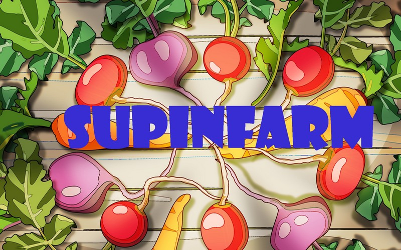
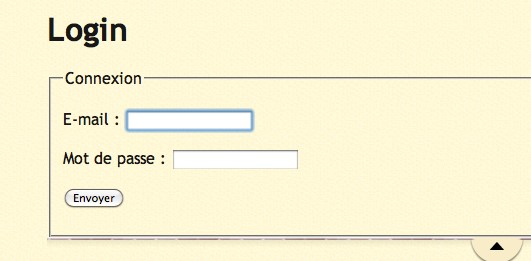
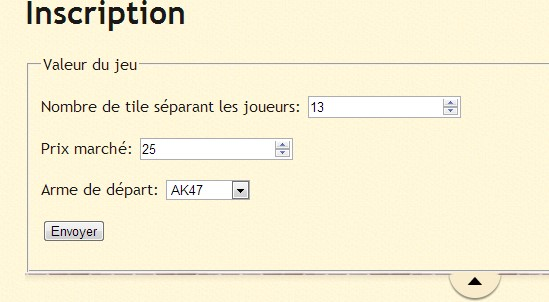
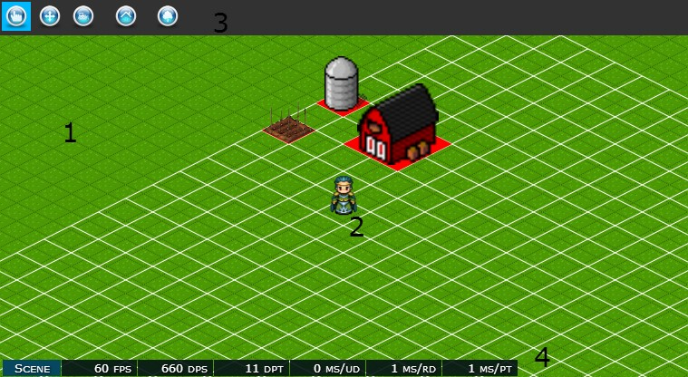

# Supinfarm (School project 2012-2013 at SUPINFO)

## Important
Ce projet date de 2013 et a été développé dans le cadre d'un projet de fin d'études. Il n'a pas été relancé depuis...
Cette documentation reprend le document rendu avec le projet.

Projet mis à disposition pour information seulement.

## Solution manual

### Client
L'application web fonctionne sur tous les navigateurs récents. 

A la date de l'écriture de ce manuel, les navigateurs testés supportant totalement le jeu sont : Windows Internet Explorer 10.0, Google Chrome version 27.0 et Firefox version 21.0.

Pour lancer une partie l'utilisateur doit tout d'abord s'enregistrer, ou se connecter s'il est déjà enregistré en cliquant sur « Jouer ».

Lors de l'enregistrement, un choix des niveaux de départ peut être fait ainsi que plusieurs autres paramètres 

Le jeu comporte une partie administration permettant aux administrateurs de définir les paramètres du jeu. 

Le jeu est à présent lancé, le joueur atterri sur la plateforme constitué de plusieurs éléments : 

__Note__ : Les images utilisées dans ce manuel comportent des données de « debug » ne figurant pas sur le jeu final.

 1.	Une carte représentant l'environnement du jeu
 2.	Le joueur lui-même modélisé par un personnage
 3.	Une barre de menu située au-dessus de la carte qui contient toutes les options du jeu
 4.	Une barre d'affichage de l'état du jeu située en bas de la carte

### La barre de menu
Plusieurs options sont présentes, comme la possibilité de placer (ou démolir) les différentes type de bâtiments et graines, ou de pouvoir déplacer la carte.  Le joueur peut donc choisir entre plusieurs types de bâtiments et graines à poser.
Les bâtiments disponibles sont : un magasin à grain, une grange et un container frigorifié.
Le joueur peut faire pousser des tomates, du blé ou du maïs.

### Un jeu multi-joueurs
Le jeu se joue en multi-joueurs et donc en temps réel. La construction ou la plantation est visible immédiatement par tous les joueurs.
Cette carte s'agrandira donc au fur et à mesure de l'ajout des joueurs. Plus grand est le nombre de joueurs, plus grande sera la carte.

### Construction de bâtiments
Le joueur ne peut construire que sur les cases lui appartenant.

### Plantation
Après avoir planté une graine, le joueur peut la voir pousser jusqu'à être prête pour la récolte.

### Monde persistant
Le jeu est persistant : les données sont enregistrées dans une base de données MongoDB, ainsi si le joueur quitte et reviens dans le jeu il retrouvera ses constructions et ses plantations tels qu'il les a laissés.

### Evènements météo
Le jeu est capable de géré des évènements météorologique tels que la pluie, ainsi il arrive que la pluie tombe, la pluie est visible par tous les joueurs.

## Technical documentation

### Installation

La partie serveur de Supinfarm a été développée en JavaScript. Le code est exécuté sur un serveur nodejs. L'installation de nodejs sur le serveur hébergeant le jeu est donc indispensable.

#### Serveur

Pour lancer le serveur exécutez la commande node app.js.
Le serveur démarrera et le jeu sera accessible à partir de http://localhost:4545.
Le serveur web écoute le port 4545, ce port doit donc être ouvert.

### Version des programmes

| Module     | Version  |
| ---------  | -------- |
| nodejs     | 0.8.9    |
| ejs        | 0.8.2    |
| express    | 3.0.0rc4 |
| socket.io  | 0.9.10   |
| mongoose   | 3.5.5    |
| underscore | 1.3.3    |

### Serveur

Le code côté serveur a été développé en JavaScript. Le programme est destiné à être exécuté par un serveur nodejs. 
Pour installer nodejs, il suffit de se rendre http://nodejs.org/download/ afin de télécharger les programmes d'installation correspondant à votre plateforme. L'installation de nodejs installera également npm qui facilite l'installation des modules pour nodejs. 
Nodejs peut être installé sous différentes plateformes : Linux, Windows et Mac. 
Le code a été testé sous nodejs version 0.8.9 sous Windows et Ubuntu. 

### Client
La partie cliente du jeu a été développée en HTML/JavaScript. 
Pour faciliter l'utilisation du canvas, nous avons utilisé le moteur de jeu IsogenicEngine.

### Communication Client/Serveur
Le jeu utilise le module pour nodejs socket.io. Ce module permet d'envoyer des informations au serveur et d'en recevoir grâce à un système d'évènements.

### Ressources
https://empiresandallies.fandom.com/wiki/Tomato
https://empiresandallies.fandom.com/wiki/Wheat
https://empiresandallies.fandom.com/wiki/Corn
https://farmville2.fandom.com/wiki/Tomato
https://farmville2.fandom.com/wiki/Wheat